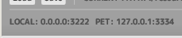
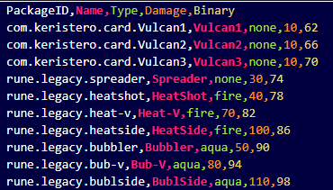

# ONB Link Gate
## Version
Release v1.2.4
Compatabile with ONB v2.5

## About 
The ONB Link Gate is a program that transfers chip data to the ONB client. 

Data is transferred in two ways:

1. By clicking or tapping on a chip image
2. Sending binary data over a serial port (e.g. COM1)

# Connecting to the ONB Client
In order to connect the Link Gate to ONB Client, the Client must be listening for the Link Gate. 

Launch ONB Client with the `-x PORT` flag where `PORT` is the port number of the full IP address pair `IP:PORT`.

The address and port pair can be found in the toolbar:



Additionally, the Link Gate is expecting the Client to be on `localhost`
with port `3334`.

Therefore, be sure to also run the Client with `-p 3334` when using
ONB Link Gate.

!!! TIP
    In networking the value of `localhost` maps to `127.0.0.1`.
    This is also called "home" or "loopback" because it allows a
    machine to ping itself in a network topology.

If done correctly, the  full set of flags will look like the following:

```sh
onb_client.exe -x 3222 -p 3334
```

## Change Listen Port
You can change the port that the ONB Link Gate is listening on with `-l` or `--local`.

e.g.
```sh
onb_link_gate.exe --local 3030
```

## Change Client Port
You can change the port that the ONB Link Gate will send packets to with `-p` or `--pet`.

e.g.
```sh
onb_link_gate.exe --pet 3000
```

## Change First Database
You can command the ONB Link Gate to open a specific database file with `-d` or `--db`.

e.g.
```sh
onb_link_gate.exe --db resources/advance_pet/db.csv
```

If ONB Link Gate fails to launch, check that your file path is correct.

# Load Chip Database
The ONB Link Gate loads a `.csv` file which contains the ID of the chip, its name, its element type, damage number, and binary representation. 



!!! NOTE 
    CSV stands for Comma-Seperated Value and by opening the `resources/db.csv` file, you will see that the format is simple to edit.

You can identify which database is currently loaded into ONB Link Gate from the toolbar:


You can also `Load` a different database file or `Save` changes to the current active database file. 

!!! NOTE 
    The `Save` button never overwrites the original file automatically. The modal file picker will open and allow you to choose where to save your changes.

# Making Changes
Different chip brands have different pin readings. The pins of a chip
correspond directly to a binary representation where each `ON` pin corresponds to the digit `1` and every `OFF` pin corresponds to the digit `0`.

While curating a database, the binary representation of a chip may need changing. Simpy click in the binary field and type the numerical value of the binary representation. This edit field will never exceed the largest bianry value below and it will inform you if there's a conflict of identical binary values in the database.

| Before | After |
| :----: | :---: |
|||

## Adding New Chip
When adding a new chip, be sure to add the chip icon inside the `images/` directory where the `db.csv` file is located.

```sh
# Typical folder structure
resources/
├─ custom_library/
│  ├─ images/
│  │  ├─ rune.bubbler.png
│  │  ├─ ...
│  ├─ db.csv
onb_link_gate.exe
```

The chip icon **must** be the ID name exactly followed by `.png`. 
For example with a new chip entry `rune.legacy.bubbler`, there should be a `images/rune.legacy.bubbler.png` image file.

# Reading Chips

ONB Link Gate is prepared to read binary numbers over the serial ports from the device it is running on. All available serial ports will be populated in the dropdown from the toolbar.
The currently selected port will have its connection status to the right of it.

Select the dropdown and choose a serial port that will communicate to ONB Link Gate. Note that this port must be open first.


When a port is connected and it reads the binary digits of a matching chip, that chip will be broadcast to ONB Client.