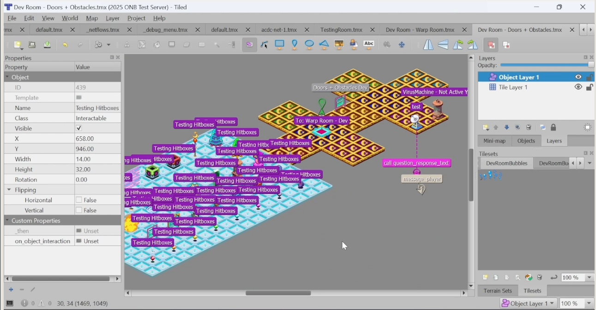
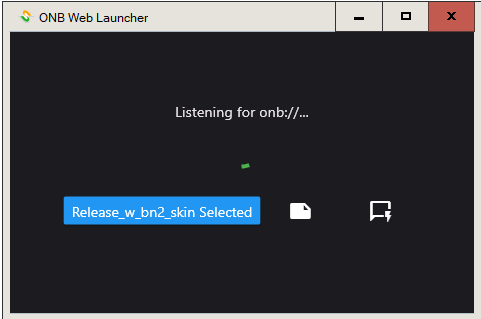
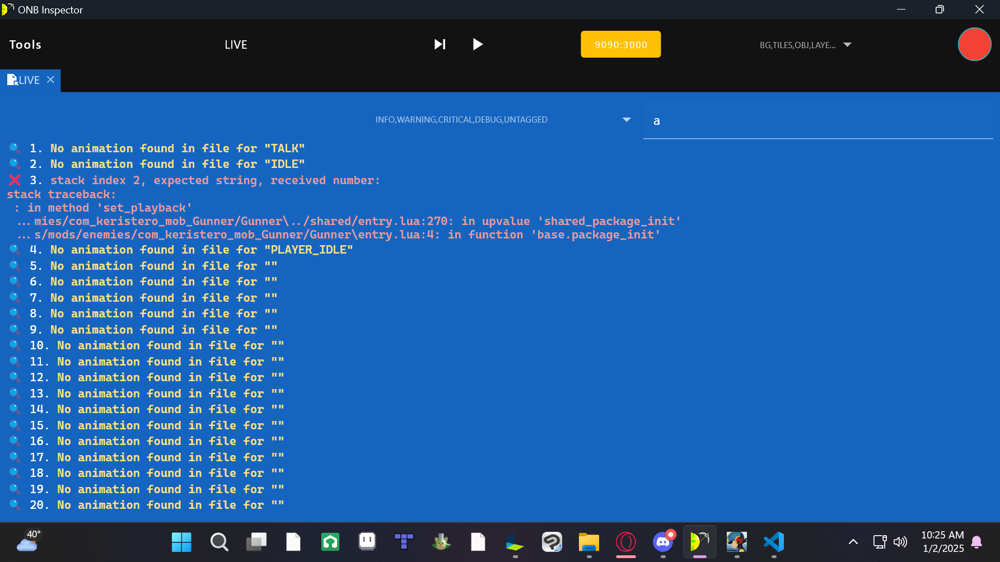

# CLIENT
> [GET][GET].

ONB Client is the engine and run-time for custom content. It aims to be feature-rich with scriptable content and dynamic online playability.

!!! note
    This is a **video** for `2.5` which is in private development.

<iframe src="https://youtube.com/embed/kS0l7a9QBzk" width="320" height="240" controls style="width: 100%;"></iframe>

# SERVER
> [GET][GET].

ONB Server is the content-delivery program and run-time for online content.

Program using [Tiled][TILED] level editor.

... or [script directly][TEMPLATE] with Lua.

# WEB LAUNCHER
> [GET][GET].

ONBWEL ("Owen-be-well") launches web URLs from the browser in ONB.
This tools allows you to launch HTML links from your browser to servers and web battles online.

# DEBUGGER
> WIP.

ONB Inspector is a custom remote debugging tool for the Client.

!!! note
    This is a **tool** for `2.5` which is in private development.

In older ONB Clients, a debug console window would popup at launch. This is no more. Now, custom debug tool allows creators to filter and search through logs in a comfortable and convenient user interface. Users will be able to toggle layer visibility in the new `2.5` renderer. Other tools are available to inspect frame data.
   

<iframe src="https://youtube.com/embed/WdFj1waZ-dI" width="320" height="240" controls style="width: 100%;"></iframe>

[CUTSCENE]: https://x.com/OpenNetBattle/status/1791855694859137478
[GET]: ./index.md
[TEMPLATE]: https://github.com/Keristero/onb-server-template
[TILED]: https://www.mapeditor.org/
